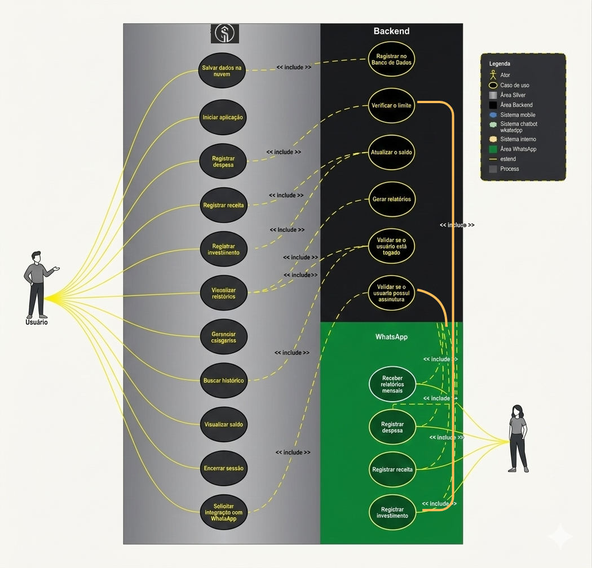
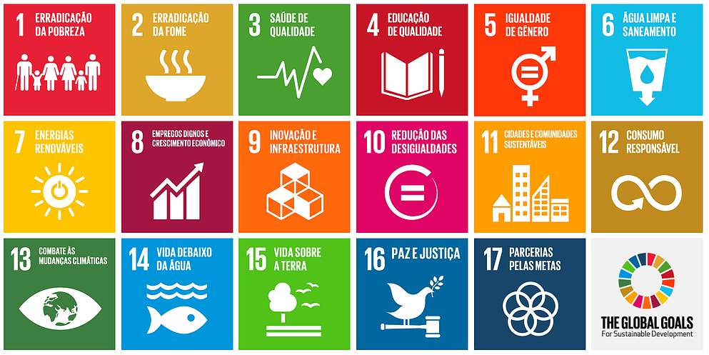

# Especificações do Projeto

Pré-requisitos: <a href="01-Documentação de Contexto.md"> Documentação de Contexto</a>

Este capítulo detalha as especificações do projeto **Silver** a partir da perspectiva do usuário. A definição do problema e a concepção da solução são aprofundadas por meio da criação de personas, histórias de usuário, requisitos funcionais e não funcionais, além das restrições e da arquitetura distribuída que nortearão o desenvolvimento.

## Personas

Para compreender as necessidades, dores e objetivos dos usuários, foram desenvolvidas três personas baseadas no público alvo identificado. Elas representam perfis distintos que se beneficiarão da solução proposta.

| Foto | Perfil | Detalhes | Motivações e Comportamento |
| :--- | :--- | :--- | :--- |
|  | **Nome:** Maria da Silva **Idade:** 38 anos **Profissão:** Auxiliar Administrativa (responsável pelo orçamento de casa) | **Renda:** R$ 2.400,00 **Tecnologia:** Familiarizada com WhatsApp e utiliza celular Android. | **Dores:** Dificuldade em controlar contas por categoria e por mês, esquece de anotar pequenos gastos e acha planilhas complicadas. **Objetivos:** Organizar despesas fixas, variáveis e metas, usar o WhatsApp para registros instantâneos e conseguir acessar relatórios simples utilizando celular. |
|  | **Nome:** João Pereira **Idade:** 24 anos **Profissão:** Autônomo, renda variável | **Renda:** R$ 2.800,00 (variável de acordo com o desempenho)  **Tecnologia:** Usuário ativo de aplicativos e redes sociais. | **Dores:** Anota gastos de forma desorganizada. **Objetivos:** Registrar entradas e saídas rapidamente e acompanhar saldo, registrar pelo WhatsApp e usar o Dashboard Web para planejamento mensal. |
|  | **Nome:** Carlos Santos **Idade:** 32 anos **Profissão:** Técnico de TI (gosta de dados e gráficos) | **Renda:** R$ 4.500,00 **Tecnologia:** Confortável com Dashboards complexos e múltiplas janelas. | **Dores:** não consegue consolidar contas, carteiras e metas num único painel, precisa de uma visão analítica potente para gerir investimentos e metas. **Objetivos:** Usar o Dashboard para análise financeira detalhada. Integração total entre dispositivos. |

## Histórias de Usuários

Com base na análise das personas foram identificadas as seguintes histórias de usuários:

|EU COMO... `PERSONA`| QUERO/PRECISO ... `FUNCIONALIDADE` |PARA ... `MOTIVO/VALOR` |
|--------------------|------------------------------------|----------------------------------------|
|Maria da Silva | Registrar uma despesa enviando um valor pelo WhatsApp | Não esquecer o gasto logo após a compra. |
|João Pereira | Visualizar meu Dashboard Web consolidado | Analisar meus lucros e despesas do mês em uma tela grande. |
|Carlos Santos | Definir metas de economia para o final do ano | Acompanhar meu progresso de forma automática. |
|João Pereira | Receber um resumo diário via WhatsApp | Ter consciência do quanto ainda posso gastar no dia. |
|Maria da Silva | Categorizar minhas contas por cor e ícone | Facilitar a identificação visual dos meus gastos no app. |

## Requisitos

As tabelas a seguir apresentam os requisitos funcionais e não funcionais que detalham o escopo do projeto, distribuídos entre os membros da equipe para desenvolvimento completo (Backend e Frontend).

# Requisitos do Projeto Silver

## Requisitos Funcionais

| ID | Descrição | Responsável |
|:---|:---|---:|
| RF01 | CRUD de transações (receitas/despesas) via API, Web e Mobile | Victor |
| RF02 | Dashboard / Home com resumo financeiro | Aécio |
| RF03 | Gerenciar grupos familiares | Nathan |
| RF04 | CRUD de categorias financeiras | Yago |
| RF05 | Gerenciamento de contas e saldo consolidado | Adrian |
| RF06 | CRUD de metas financeiras com progresso | Vinícius |
| RF07 | Autenticação (Login/Registro) e perfil | Aécio |
| RF08 | Anexar comprovantes por câmera/galeria | Nathan |
| RF09 | CRUD de orçamentos mensais | Adrian |
| RF10 | Histórico filtrável de movimentações | Victor |
| RF11 | Tema claro/escuro no Mobile | Nathan |
| RF12 | Extrato mensal com saldo por período | Vinícius |
| RF13 | Sincronização Web/Mobile via API | Nathan |
| RF14 | Indicadores de gastos por categoria | Yago |

## Requisitos Não Funcionais

| ID | Descrição | Prioridade |
|:---|:---|---:|
| RNF01 | Backend desenvolvido com Laravel (PHP) | Alta |
| RNF02 | Dashboard Web responsivo para navegadores modernos | Alta |
| RNF03 | Arquitetura distribuída (API REST) para integração multiplataforma | Média |
| RNF04 | Comunicações sensíveis via HTTPS | Alta |
| RNF05 | Tempo de resposta da API ≤ 3 segundos | Alta |
| RNF06 | Banco NoSQL (MongoDB) com consistência e integridade | Alta |
| RNF07 | App mobile com React Native + Expo | Alta |
| RNF08 | Autenticação via tokens (Laravel Sanctum) | Alta |

## Matriz de Rastreabilidade

A matriz de rastreabilidade de requisitos é utilizada para garantir que cada requisito do sistema esteja vinculado a um objetivo de negócio (história de usuário) e a um componente de projeto (caso de uso/módulo).

| Requisito | História de Usuário | Caso de Uso / Módulo |
| :--- | :--- | :--- |
| **RF01** | Maria / João - Registrar transação | UC01 - Registrar Transação (WhatsApp/Web) |
| **RF02** | João / Carlos - Visualizar Dashboard | UC02 - Visualizar Painel Financeiro |
| **RF03** | Carlos - Sincronização de Dispositivos | Módulo de Sincronização de Dados |
| **RF04** | Maria - Categorizar Contas | UC03 - Gerenciar Categorias |
| **RF05** | João - Saldo Consolidado | Módulo de Cálculo Financeiro |
| **RF06** | Carlos - Metas de Economia | UC04 - Gerenciar Metas |
| **RF07** | Geral - Autenticação | UC05 - Autenticar Usuário |
| **RF08** | Nathan - Anexar Comprovantes | UC07 - Upload de Documentos |
| **RF09** | Adrian - Orçamentos Mensais | UC08 - Gerenciar Orçamentos |
| **RF10** | Victor - Histórico Filtrável | UC09 - Consultar Histórico |
| **RF11** | Nathan - Tema claro/escuro | Módulo de Tema |
| **RF12** | Vinícius - Extrato Mensal | UC04 - Gerenciar Metas |

## Restrições

O projeto está restrito pelas condições apresentadas na tabela a seguir:

|ID| Restrição |
|--|-------------------------------------------------------|
|01| O projeto deve ser entregue até o final das 16 semanas letivas do semestre. |
|02| A infraestrutura deve usar apenas planos gratuitos (*free tiers*), como Render/Azure para backend e Netlify para frontend, além de cotas gratuitas para a API do WhatsApp. |
|03| O desenvolvimento do backend é estritamente obrigatório utilizando Laravel. |

## Arquitetura Distribuída

O **Silver** utiliza uma arquitetura distribuída composta pelos seguintes componentes principais:
1. **API Gateway / Backend (Laravel)**: Núcleo central que processa as regras de negócio, autenticação e comunicação com o banco de dados não-relacional (MongoDB).
2. **Dashboard Web**: Interface frontend consumindo a API Laravel para análises detalhadas.
3. **WhatsApp Bridge (Node.js/Webhook)**: Microsserviço que processa mensagens enviadas pelo usuário no WhatsApp e as direciona para a API principal criar os registros.
4. **App Mobile**: Aplicativo auxiliar para consultas rápidas na palma da mão.

## Diagrama de Casos de Uso

O diagrama de casos de uso ilustra a fronteira do sistema e o detalhamento das principais interações dos usuários com os serviços distribuídos oferecidos pelo Silver.

## Descrição dos Casos de Uso

A seguir, são detalhados os fluxos principais e exceções dos casos de uso que compõem o sistema Silver.

### UC01 - Registrar Transação (WhatsApp/Web)
- **Ator**: Usuário.
- **Descrição**: Permite o registro de uma nova entrada (receita) ou saída (despesa).
- **Fluxo Básico**: 
    1. O usuário envia o valor e descrição via WhatsApp ou preenche o formulário na Web.
    2. O usuário seleciona a **conta de origem/destino** (ex: Itaú, Nubank) vinculada à sua família.
    3. O sistema valida os dados, a conta e a categoria.
    4. O sistema confirma o registro e atualiza o saldo consolidado da conta e o progresso orçamentário da família.
- **Exceção**: Valor inválido, conta inexistente ou falta de conexão com o banco de dados NoSQL.

### UC02 - Visualizar Painel Financeiro
- **Ator**: Usuário.
- **Descrição**: Exibe o saldo consolidado e gráficos de desempenho financeiro.
- **Fluxo Básico**:
    1. O usuário acessa o Dashboard Web ou a tela principal do App.
    2. O sistema recupera as transações do mês vigente.
    3. O sistema renderiza os gráficos e o saldo atual.

### UC03 - Gerenciar Categorias
- **Ator**: Usuário.
- **Descrição**: Permite personalizar as categorias de gastos (ex: Alimentação, Lazer).
- **Fluxo Básico**:
    1. O usuário acessa a área de configurações de categorias.
    2. O usuário cria, edita ou exclui uma categoria (nome, cor, ícone).
    3. O sistema salva as alterações.

### UC04 - Gerenciar Metas
- **Ator**: Usuário.
- **Descrição**: Define objetivos financeiros de economia.
- **Fluxo Básico**:
    1. O usuário define um valor alvo e uma data limite.
    2. O sistema monitora as economias vinculadas à meta.
    3. O sistema exibe a porcentagem de conclusão.

### UC05 - Autenticar Usuário
- **Ator**: Usuário.
- **Descrição**: Garante o acesso seguro à plataforma.
- **Fluxo Básico**:
    1. O usuário informa e-mail e senha.
    2. O sistema valida as credenciais via API Laravel.
    3. O sistema gera um token de acesso (JWT/Sanctum).

### UC06 - Gerar Relatórios
- **Ator**: Usuário.
- **Descrição**: Exporta dados financeiros para consulta offline.
- **Fluxo Básico**:
    1. O usuário seleciona o período e o formato (PDF/CSV).
    2. O sistema processa os dados e gera o arquivo.
    3. O download é iniciado automaticamente.

### UC07 - Upload de Documentos
- **Ator**: Usuário.
- **Descrição**: Permite anexar fotos de recibos às transações.
- **Fluxo Básico**:
    1. O usuário seleciona uma transação existente.
    2. O usuário faz o upload da imagem do comprovante.
    3. O sistema vincula o arquivo à transação no storage.

### UC08 - Gerenciar Orçamentos
- **Ator**: Usuário.
- **Descrição**: Define limites de gastos por categoria para o mês.
- **Fluxo Básico**:
    1. O usuário define um teto de gastos para uma categoria específica.
    2. O sistema alerta quando o gasto se aproxima do limite.

### UC09 - Consultar Histórico
- **Ator**: Usuário.
- **Descrição**: Permite a busca e filtragem de transações passadas.
- **Fluxo Básico**:
    1. O usuário utiliza filtros (data, categoria, valor).
    2. O sistema exibe a lista de transações correspondentes.

# Gerenciamento de Projeto

De acordo com o PMBoK, atualmente em sua oitava edição, as dez áreas que constituem os pilares para gerenciar projetos, e que caracterizam a multidisciplinaridade envolvida, são: integração, Escopo, Cronograma (Tempo), Custos, Qualidade, Recursos, Comunicações, Riscos, Aquisições, Partes Interessadas. Para desenvolver projetos, um profissional deve se preocupar em gerenciar todas essas dez áreas. Elas se complementam e se relacionam, de tal forma que não se deve apenas examinar uma área de forma estanque. É preciso considerar, por exemplo, que as áreas de Escopo, Cronograma e Custos estão muito relacionadas. Assim, se o escopo de um projeto é ampliado, afetará seu cronograma e seus custos.

## Gerenciamento de Tempo

O desenvolvimento foi estruturado em um cronograma macro de 16 semanas, dividido em quatro ciclos principais (Sprints Mensais):

- **Semanas 1-4 (Mês 1)**: Concepção do projeto, Planejamento da Especificação e Setup do Backend (Laravel).
- **Semanas 5-8 (Mês 2)**: Construção do Dashboard Web e implementação do banco de dados não-relacional (MongoDB).
- **Semanas 9-12 (Mês 3)**: Desenvolvimento da integração com WhatsApp (Bridge) e rotas de API.
- **Semanas 13-16 (Mês 4)**: Desenvolvimento do App Mobile, testes de sincronização, correções e entrega final.

A primeira versão do cronograma está apresentada a seguir.

## Gerenciamento de Custos

O projeto Silver foi concebido para operar majoritariamente sobre infraestruturas de nível gratuito (*Free-Tier*), minimizando o investimento inicial. Neste momento, não estamos prevendo nenhum custo para o desenvolvimento do projeto, visto que será desenvolvido por alunos do curso de Análise e Desenvolvimento de Sistemas da PUC Minas. Os softwares que serão utilizados para elaboração do projeto serão gratuitos ou mesmo com licença grátis para estudantes. O único custo que o projeto poderá gerar é o custo para fazer o upload da aplicação para as plataformas de comercialização (o que será revisado em momento oportuno).

| Item | Descrição | Valor Estimado (Mensal) |
| :--- | :--- | :--- |
| **Hospedagem Backend** | Laravel Cloud (Plano Gratuito) | R$ 0,00 |
| **Hospedagem Frontend** | Netlify / GitHub Pages | R$ 0,00 |
| **Banco de Dados** | MongoDB Atlas (M0 Free Tier) | R$ 0,00 |
| **API WhatsApp** | Evolução API / Cotas Gratuitas | R$ 0,00 |
| **Mão de Obra** | 6 Desenvolvedores (Estudantes) | R$ 0,00 |
| **Custo Total** | --- | **R$ 0,00** |

*Nota: Em cenários de escala comercial, seriam considerados custos de licenciamento da API oficial da Meta (WhatsApp Business) e instâncias pagas de servidor para garantir SLA.*

## Gerenciamento de Equipe

A equipe utiliza a metodologia ágil **Scrum** para organizar o trabalho. O processo é dividido em sprints mensais com reuniões de planejamento, revisão e daily meetings para alinhamento contínuo. O quadro Kanban do **GitHub Projects** é utilizado para acompanhar o progresso das tarefas, organizadas nas colunas *Backlog*, *To Do*, *In Progress*, *Review* e *Done*, vinculando Pull Requests diretamente às entregas de cada desenvolvedor.

## Impacto Social e Sustentabilidade

Contribuição para os ODS
- ODS 1: solução híbrida gratuita (*app* + *WhatsApp*) para controle financeiro acessível
- ODS 8: educação financeira integrada usando tecnologia nativa e conversacional
- ODS 10: democratização via *app* nativo profissional + *WhatsApp* familiar

Métricas de Sucesso
- 500+ usuários ativos nos primeiros 6 meses
- 85% de precisão no reconhecimento de linguagem natural
- 75% dos usuários reportam melhora no controle financeiro
- 60% conseguem manter orçamento mensal consistente
- Tempo medio de resposta inferior a 2 segundos para requisicoes da API
