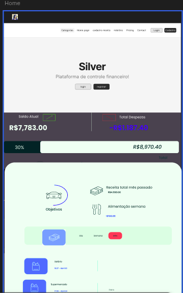
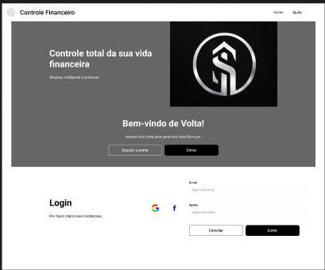
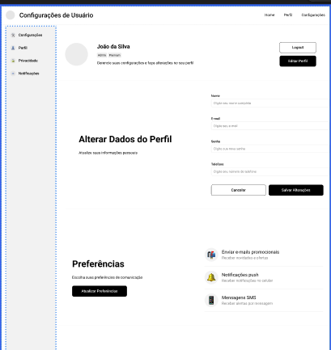
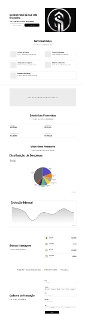
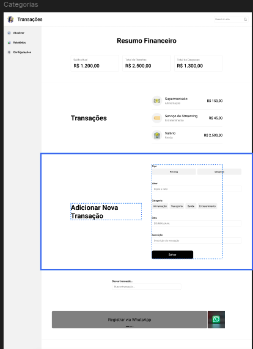
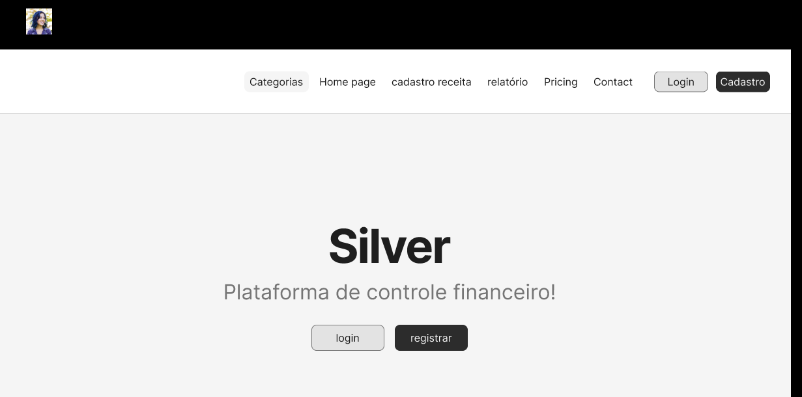
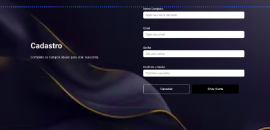

# Projeto de Interface

Pré-requisitos: <a href="02-Especificação do Projeto.md"> Documentação de Especificação</a>

Visão geral da interação do usuário com as telas do sistema, incluindo o protótipo interativo com as funcionalidades que compõem o Silver, tanto na versão Web quanto na versão Mobile.

## Fluxo de Navegação

O fluxo de interação do usuário com o Silver foi planejado para minimizar a fricção no registro financeiro. O usuário chega na landing page, cria sua conta ou faz login, e acessa o dashboard com a visão consolidada de saldo, receitas e despesas do mês. A partir do dashboard, pode navegar para contas, transações, orçamentos, metas e configurações.

## Wireframes Web

As telas Web foram prototipadas no Figma com foco em usabilidade e visualização clara dos dados financeiros. Abaixo os principais wireframes:

## Wireframes Mobile

A versão Mobile segue a mesma identidade visual da Web, adaptada para telas menores com navegação por abas e gestos. Os protótipos mobile estão disponíveis no Figma.

> **FIGMA SILVER**:
> - [Veja nosso Wireframe no Figma completo](https://www.figma.com/design/npC61aU8dnzFzvTuCfxXfw/silver-wireframe?node-id=0-1&t=5IGyKrytdM2cGXC2-1)
