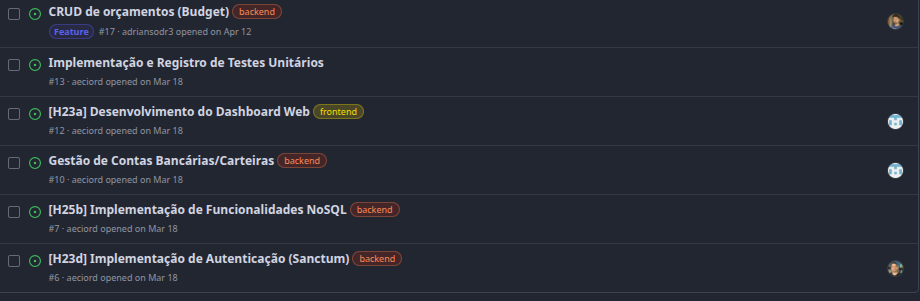
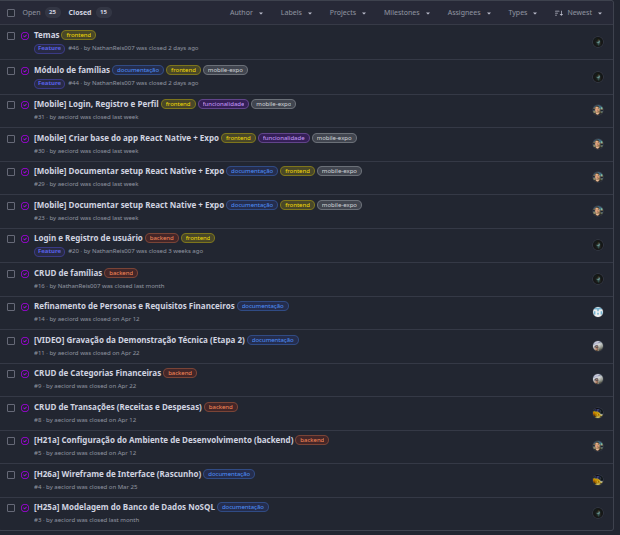

# Documentação do Projeto de Trabalho em Equipe

# Silver App Gestão Financeira

## Visão Geral

O **Silver App Gestão Financeira** é uma aplicação distribuída desenvolvida para auxiliar usuários no controle financeiro pessoal por meio de uma plataforma integrada composta por API, aplicação Web e aplicação Mobile.

Este documento apresenta um resumo das atividades realizadas em cada etapa do projeto, bem como as contribuições individuais dos integrantes da equipe.

---

# 📌 Etapa 1 - Planejamento e Levantamento de Requisitos

### Resumo

- Definição do escopo do projeto.
- Levantamento dos requisitos funcionais e não funcionais.
- Definição da arquitetura da solução.
- Planejamento das atividades e organização da equipe.

### 📅 Prazo

**Conclusão:** 06/03/2026

### 👨‍💻 Contribuições Individuais

#### Adrian Sodré da Silva
- Participação no levantamento dos requisitos funcionais voltados ao controle financeiro familiar.
- Contribuição na definição das histórias de usuário relacionadas a orçamentos e metas financeiras.
- Auxílio na elaboração do backlog e na organização das atividades da equipe.

#### Aécio Ribeiro Dantas Neto
- Elaboração da documentação de contexto e especificação do projeto Silver.
- Definição da visão, arquitetura e escopo da aplicação.
- Criação do guia de execução e status da arquitetura.

#### Nathan David Reis
- Participação no levantamento de requisitos funcionais e não funcionais.
- Modelagem dos dados e elaboração do diagrama ER.

#### Victor da Silva Folgado
- Aprimoramento da introdução do projeto, tornando a contextualização mais clara e objetiva.
- Revisão e complementação da descrição do problema abordado pela aplicação.
- Ampliação do conteúdo documental com acréscimo de informações relevantes para o entendimento da proposta.
- Definição e detalhamento do público-alvo, incluindo características e necessidades dos usuários.
- Inclusão e documentação do Diagrama de Casos de Uso para representar as funcionalidades principais do sistema.
- Revisão geral da documentação da etapa, contribuindo para maior organização, clareza e qualidade do material entregue.

#### Vinícius Soares Pires e Luz
- Contribuição na elaboração da documentação de contexto;
- Contribuição na elaboração das especificações do projeto;
- Contribuição na elaboração da metodologia de desenvolvimento;
- Elaboração do cronograma de desenvolvimento do projeto;
- Estudo das atividades e microfundamentos;
- Envio da documentação no sistema.

#### Yago Lopes Miranda
- Levantamento de requisitos funcionais relacionados a metas e movimentações financeiras
- Contribuição nas histórias de usuário relacionadas a metas e movimentações financeiras
- Auxílio na organização das atividades da equipe.

---

# =====================================================================

# 📌 Etapa 2 - Desenvolvimento do Back-end e Web API

### Resumo

- Desenvolvimento da Web API REST.
- Implementação da autenticação de usuários.
- Definição de rotas e recursos.
- Integração com banco de dados NoSQL.
- Documentação da arquitetura e da API.

### 📅 Prazo

**Conclusão:** 15/04/2026

### 👨‍💻 Contribuições Individuais

#### Adrian Sodré da Silva
- Implementação do sistema de autenticação com Laravel Sanctum adaptado para MongoDB.
- Desenvolvimento do modelo `PersonalAccessToken` compatível com banco de dados NoSQL.
- Criação do CRUD de categorias com geração automática de categorias padrão para novos usuários.
- Configuração da integração da API com o MongoDB Atlas.
- Desenvolvimento dos endpoints de orçamentos (budgets) na API REST.

#### Aécio Ribeiro Dantas Neto
- Setup inicial do backend Laravel 12 com MongoDB e Sanctum.
- Implementação da autenticação com Sanctum adaptado para MongoDB.
- Criação do CRUD de categorias com seed automático.
- Configuração de MongoDB local via Docker.
- Correções de compatibilidade do PersonalAccessToken com MongoDB.
- Aplicação da identidade visual Silver e tradução pt-BR nas views Blade.
- Documentação técnica do backend, rotas e guia de instalação.

#### Nathan David Reis
- Implementação do módulo de famílias na API, permitindo que múltiplos usuários compartilhem acesso aos dados financeiros.
- Criação das coleções necessárias no MongoDB para suporte ao módulo de famílias.
- Ajustes nas colunas do banco de dados para adequação ao módulo.
- Adaptação do diagrama ER para contemplar o módulo de famílias.
- Elaboração de trechos da documentação referentes ao banco de dados.

#### Victor da Silva Folgado
- Desenvolvimento e documentação dos wireframes da aplicação.
- Criação e organização dos protótipos iniciais no Figma.
- Inclusão de imagens dos wireframes na documentação do projeto.
- Disponibilização do link de acesso ao protótipo para a equipe.
- Revisão dos fluxos de navegação e validação da estrutura visual proposta.
- Apoio na organização da documentação da interface e definição da experiência do usuário.
- Ajuda no início do desenvolvimento

#### Vinícius Soares Pires e Luz
- Revisão na documentação do projeto;
- Elaboração do CRUD de metas para o desenvolvimento do projeto Web;
- Revisão dos fluxos e caminhos do projeto para inclusão das metas no projeto;
- Envio da documentação no sistema.

#### Yago Lopes Miranda
- Contribuição no início do desenvolvimento
- Produção e edição do vídeo da apresentação da etapa
- Ajustes e revisão na documentação do projeto
---

# =====================================================================

# 📌 Etapa 3 - Desenvolvimento do Front-end Web

### Resumo

- Desenvolvimento da aplicação Web.
- Integração com a Web API.
- Criação das telas e fluxos de navegação.
- Desenvolvimento de wireframes e protótipos.
- Implementação de dashboards e indicadores.
- Realização de testes de unidade e integração.

### 📅 Prazo

**Conclusão:** 15/05/2026

### 👨‍💻 Contribuições Individuais

#### Adrian Sodré da Silva
- Desenvolvimento da tela de orçamentos (budgets) na aplicação web com Livewire.
- Implementação do CRUD completo de orçamentos no frontend web, incluindo criação, listagem, edição e exclusão.
- Integração da tela de orçamentos com a API REST do backend.
- Criação de componente com barra de progresso visual para acompanhamento dos limites de gastos por categoria.
- Ajustes na navegação lateral para inclusão do acesso à tela de orçamentos.

#### Aécio Ribeiro Dantas Neto
- Implementação do CRUD completo de Contas (Accounts) no frontend web.
- Criação do Dashboard dinâmico com integração à API.
- Melhoria da UX nos modais de Transações com selects de Conta e Categoria.
- Sincronização dos saldos das Contas ao registrar transações.
- Correções de layout e renderização nas telas de Metas e Transações.

#### Nathan David Reis
- Inclusão do módulo de famílias nas telas da aplicação web, seguindo as definições da documentação e em cumprimento aos requisitos funcionais.

#### Victor da Silva Folgado
- Implementação das funcionalidades de receitas e despesas no sistema.
- Criação das rotas relacionadas às transações financeiras.
- Desenvolvimento das telas de receitas e despesas no Front-end Web.
- Ajustes e manutenção da estrutura do projeto durante a integração entre Front-end e Back-end.
- Participação na validação das funcionalidades implementadas.
- Revisão geral da interface e correção de inconsistências identificadas durante os testes.
- Produção e gravação do vídeo de apresentação da etapa.

#### Vinícius Soares Pires e Luz
- Conclusão e testes do CRUD de metas;
- Conexão e revisão do CRUD junto ao projeto;
- Estudos para implementação do CRUD para o sistema mobile.

#### Yago Lopes Miranda
- Implementação do CRUD de categorias financeiras, com criação, edição, exclusão, e listagem
- Organização das tarefas do grupo

---

# =====================================================================

# 📌 Etapa 4 - Desenvolvimento do Front-end Mobile

### Resumo

- Desenvolvimento da aplicação Mobile.
- Integração com a Web API.
- Implementação das telas e navegação do aplicativo.
- Criação de protótipos e documentação.
- Desenvolvimento de testes de unidade, integração e sistema.

### 📅 Prazo

**Conclusão:** 15/06/2026

### 👨‍💻 Contribuições Individuais

#### Adrian Sodré da Silva
- Desenvolvimento do CRUD completo de orçamentos na aplicação mobile (React Native / Expo).
- Implementação da tela de orçamentos com listagem por cartão, barra de progresso colorida por percentual e ações de edição e exclusão.
- Criação do modal de cadastro e edição com seleção de categoria, mês de referência e valor limite.
- Correção do fluxo de autenticação no mobile: resolução do problema de token Sanctum inválido com MongoDB, onde o `PersonalAccessToken` não capturava o `ObjectId` gerado na inserção.
- Ajuste no ciclo de vida do modelo para geração correta do identificador antes da persistência no banco.
- Correção de incompatibilidade no comportamento do `Alert.alert` no ambiente web para a ação de exclusão.

#### Aécio Ribeiro Dantas Neto
- Criação da base mobile com React Native e Expo.
- Integração da autenticação inicial no aplicativo mobile.
- Melhorias no diagnóstico da API no mobile.

#### Nathan David Reis
- Validação e pequeno ajuste no login por biometria implementado pelo Aécio.
- Implementação do módulo de famílias na aplicação mobile.
- Implementação da opção de tema claro e escuro no aplicativo.
- Implementação da funcionalidade de anexar foto ao registrar uma transação, com suporte à captura pela câmera ou seleção da galeria.

#### Victor da Silva Folgado
- Criação dos wireframes da aplicação Mobile.
- Organização e documentação dos protótipos desenvolvidos no Figma.
- Adição de novas referências à documentação do projeto.
- Implementação do CRUD da tela de transações.
- Desenvolvimento da funcionalidade de exclusão de transações.
- Correções e melhorias na tela de transações.
- Revisão e ajustes em funcionalidades já existentes.
- Apoio nos testes e validação das funcionalidades implementadas.

#### Vinícius Soares Pires e Luz
- Revisão na documentação do projeto;
- Inclusão das telas web e mobile na documentação do projeto;
- Implementação do CRUD de metas mobile;
- Execução de testes no CRUD de metas.

#### Yago Lopes Miranda
- Implantação e updates no CRUD de categorias financeiras
- Revisão e ajustes em funcionalidades já existentes

---

# =====================================================================

# 📌 Etapa 5 - Diagnóstico, Entrega da Solução e Apresentação

### Resumo

- Consolidação da documentação do projeto.
- Avaliação das tecnologias utilizadas.
- Elaboração das considerações finais.
- Análise crítica da solução desenvolvida.
- Preparação da apresentação final.
- Gravação do vídeo demonstrativo.

### 📅 Prazo

**Conclusão:** 30/06/2026

### 👨‍💻 Contribuições Individuais

#### Adrian Sodré da Silva
- _Preencher_

#### Aécio Ribeiro Dantas Neto
- _Preencher_

#### Nathan David Reis
- _Preencher_

#### Victor da Silva Folgado
- Revisão e consolidação da documentação do projeto.
- Elaboração dos slides da apresentação final.
- Edição do vídeo de apresentação da etapa.
- Correção de bug na exclusão de transações.
- Registro dos testes de sistema com prints de evidência.

#### Vinícius Soares Pires e Luz
- Revisão e consolidação da documentação do projeto.
- Apresentação final do projeto.
- Registro dos testes de sistema com prints de evidência dos testes do crud de metas.
- Envio do projeto em todas as etapas.

#### Yago Lopes Miranda
- Vídeo da apresentação final, sendo o Pitch de vendas do projeto Silver
- Apoio na revisão geral do documento e do projeto
- Apoio na organização e finalização da entrega do projeto

---

# =====================================================================

# 📊 Kanban e Contribuições da Equipe

## Quadro Kanban

> Inserir aqui os prints do quadro Kanban do GitHub Projects.

### Print 1

### Print 2

---

## Histórico de Contribuições

> Inserir aqui os prints das contribuições dos integrantes no GitHub.

### Contribuições da Equipe

---

# =====================================================================

# ✅ Projeto Finalizado

O **Silver App Gestão Financeira** foi concluído com a entrega de todas as etapas previstas, incluindo planejamento, desenvolvimento da API, aplicação Web, aplicação Mobile, documentação técnica e apresentação final.
