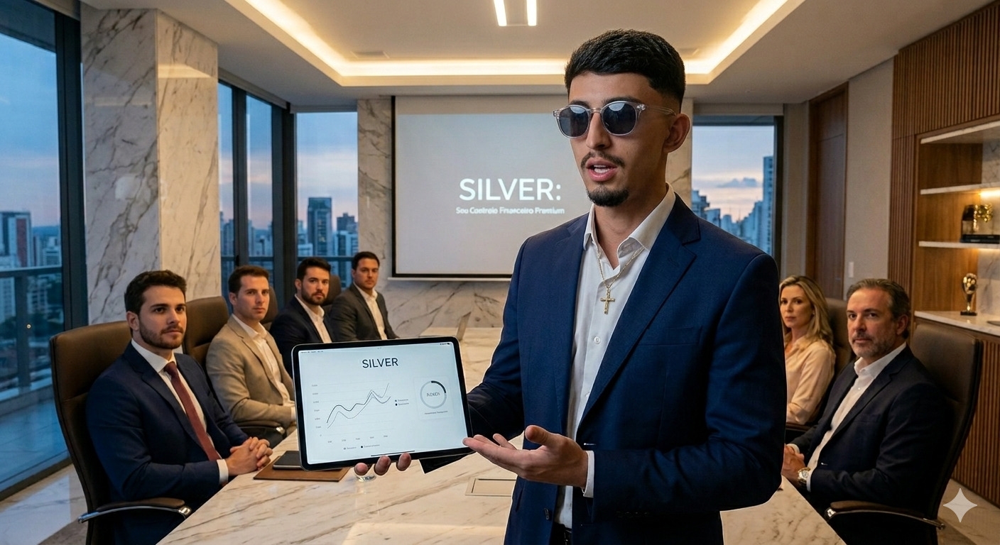

# 📄 Considerações Finais — Avaliações Individuais

Documento com as considerações finais do projeto e a avaliação individual de cada membro da equipe:

- **[Considerações finais - avaliacoes individuais.pdf](./img/kanbanimgs/Consideracoes.finais.-.avaliacoes.individuais.pdf)** — Versão PDF
- **[Considerações finais - avaliacoes individuais.docx](https://github.com/user-attachments/files/29176605/Consideracoes.finais.-.avaliacoes.individuais.docx)** — Versão DOCX

---

# Apresentação

## Título do Projeto

**SILVER** — Aplicação distribuída para gestão financeira pessoal.

## Identidade Visual (Marca, Design)

A identidade visual do Silver utiliza uma paleta de cores que transmite confianca e solidez financeira:
- **Verde institucional** (#1B7F73): remete a crescimento, estabilidade e saude financeira
- **Fundo neutro** (#F4EFE7): tons terrosos claros que transmitem aconchego e acessibilidade
- **Detalhe em dourado** (#F0B548): destaca acoes importantes e CTAs
- **Tipografia**: Space Grotesk (titulos) e Manrope (corpo), combinando modernidade e legibilidade

## Equipe do Projeto

| Membro | Funcao |
|--------|--------|
| Adrian Sodre da Silva | Desenvolvimento Backend e Testes,dev |
| Aecio Ribeiro Dantas Neto | Scrum Master, Documentacao, dev |
| Nathan David Reis | Product Owner, Modelagem de Dados |
| Victor da Silva Folgado | Design de Interface, Documentacao, dev |
| Vinicius Soares Pires e Luz | Desenvolvimento Mobile e web|
| Yago Lopes Miranda | Desenvolvimento Full Stack, dev |

## Slides da Apresentação

A apresentação completa do projeto Silver está disponível no Canva:

👉 **[ACESSAR APRESENTAÇÃO NO CANVA](https://canva.link/silverapresgrupo3)**

## Pitch de Vendas

🎬 **Pitch Silver** · 4:30 min

## Vídeos por Etapa

| Etapa | Descrição | Link |
|-------|-----------|------|
| **Etapa 1** | Primeira entrega | [📹 Assistir](../videos/video-primeira-entrega.mov) |
| **Etapa 2** | Segunda entrega | [📹 Assistir](../videos/video-segunda-entrega.mp4) |
| **Etapa 3** | Demonstração | [📹 Assistir](https://www.youtube.com/watch?v=9LaAyllUSNs) |
| **Etapa 4** | Demonstração | [📹 Assistir](https://www.youtube.com/watch?v=VXqXZXYeBZY) |
| **Etapa 5** | Apresentação final | [📹 Assistir](https://youtu.be/wll2heqi7W0) |

> Os slides e vídeos completos também estão disponíveis no arquivo [`presentation/README.md`](../presentation/README.md).

---

> [!NOTE]
> As contribuições individuais de cada membro da equipe, incluindo o detalhamento das atividades realizadas por etapa, estão registradas no documento **[Registro de Contribuição](11-Registro%20de%20Contribui%C3%A7%C3%A3o.md)** — consulte-o para uma visão completa da participação de cada integrante ao longo de todo o projeto.

